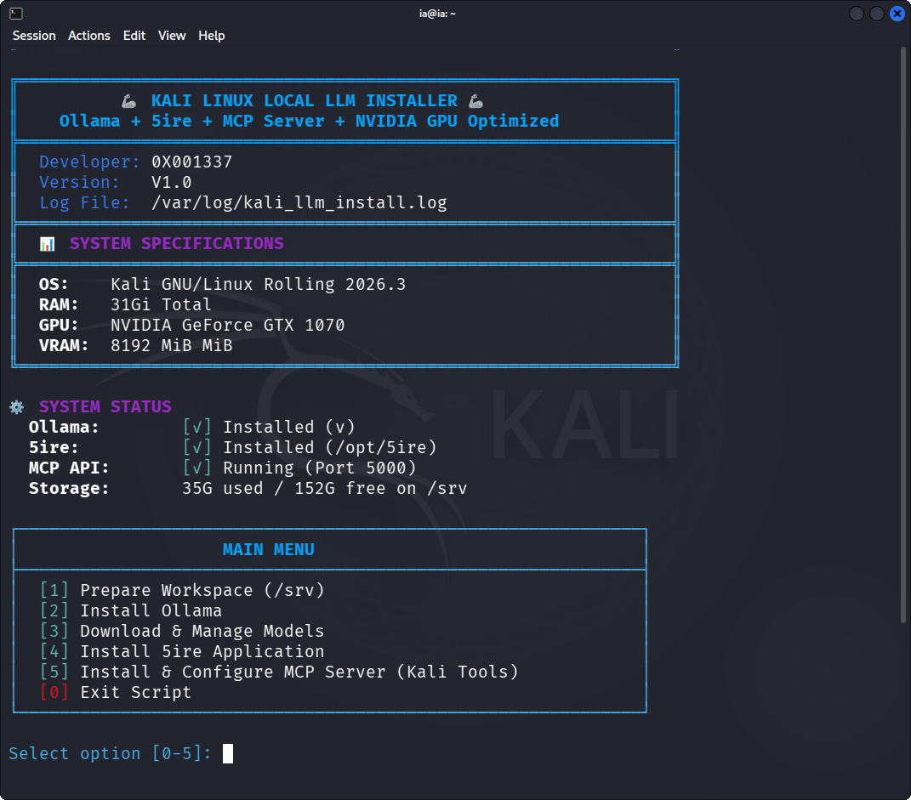
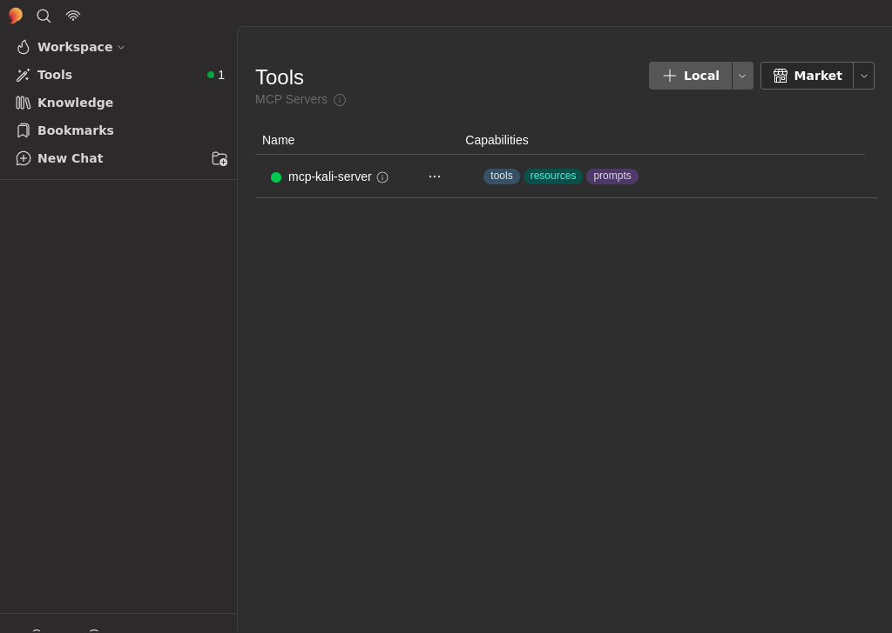
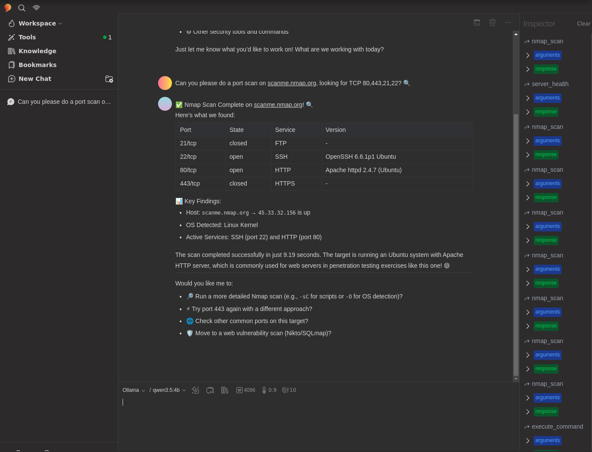

# 🦾 Kali LLM Installer

> **Enterprise-grade Local LLM + MCP Installer for Kali Linux**
> Run and manage local LLMs entirely on Kali Linux — fully offline, no cloud services.

<p align="center">
  
  <br><em>The script's main interface (live status dashboard + menu)</em>
</p>

<p align="center">
  
  
  
  
  
</p>

---

## 📖 Overview

An interactive Bash script that automates the setup of a **fully local AI environment** on Kali Linux,
where natural language replaces manual command input — all processing happens on your own hardware,
with no reliance on any third-party service.

The script brings together:

| Component | Role |
|---|---|
| **[Ollama](https://ollama.com/)** | Runs LLMs locally (a wrapper around `llama.cpp`) |
| **[5ire](https://github.com/nanbingxyz/5ire)** | GUI + MCP Client |
| **[mcp-kali-server](https://www.kali.org/tools/mcp-kali-server/)** | MCP server bridging the model to Kali security tools |
| **NVIDIA CUDA** | GPU-accelerated inference |

> Based on the official guide: [Kali & LLM: Completely local with Ollama & 5ire](https://www.kali.org/blog/kali-llm-ollama-5ire/), with an isolated `/srv` layout plus simplified service and update management.

---

## ✨ Features

- 🎛️ **Interactive menu** with a live status dashboard (OS, RAM, GPU, service status, storage usage).
- 🗂️ **Isolated `/srv` layout** — models and binaries kept away from the base filesystem.
- 📦 **Full model management** — pull from the Ollama library or build GGUF models from Hugging Face (with automatic `mmproj` vision-projector detection).
- 🔄 **Unified updates** — system tools + Ollama + 5ire from a single place.
- ⚙️ **Service management** — start/stop/restart and view logs for the `MCP API` and `Ollama`.
- 🛡️ **Safe input** — sanitization and strict allow-lists to prevent command injection.
- 🖥️ **NVIDIA GPU support** — detects the card and installs the proprietary (CUDA) drivers.
- 🧩 **5ire integration** — a smart launcher that auto-starts Ollama + a Kali desktop menu entry.

---

## 📋 Requirements

- **OS**: Kali Linux (Rolling).
- **Privileges**: must be run as `root` (via `sudo`).
- **Recommended hardware**: an NVIDIA card with **6 GB VRAM** or more (CPU works but is slow).
- **Disk**: several GB free on `/srv` (depending on model sizes).
- **Internet**: required to download binaries and models.

---

## 🚀 Installation & Usage

```bash
git clone https://github.com/OXOO1337/Kali_LLM.git
cd Kali_LLM
chmod +x Kali_LLM.sh
sudo ./Kali_LLM.sh
```

> The script must be run as `root`. It automatically checks dependencies and installs any that are missing.

---

## 🧭 Main Menu

```
[1] Prepare Workspace (/srv)                 Create working directories
[2] Install Ollama                           Install Ollama
[3] Download & Manage Models                 Download and manage models
[4] Install 5ire Application                 Install the 5ire GUI
[5] Install & Configure MCP Server           Install the MCP server + Kali tools
[6] Update Tools (System + Ollama + 5ire)    Update all components
[7] Manage Services (MCP API + Ollama)       Manage services
[0] Exit Script                              Quit
```

### Recommended first-run order
`[1]` → `[2]` → `[3]` (pick a model) → `[4]` → `[5]` → then connect MCP inside 5ire.

---

## 🤖 Model Management

<p align="center">
  
  <br><em>The model management interface (download / list / remove)</em>
</p>

Option `[3]` supports:

1. **Pull from the Ollama library** (recommended) — Tools-capable models:
   - `qwen2.5:7b`, `qwen2.5:3b`, `mistral-nemo`
   - `llama3.1:8b`, `llama3.2:3b`, `qwen3:4b` *(from the official guide)*
2. **Build from Hugging Face (GGUF)** — enter the `repo`, `filename.gguf`, and a model name, with automatic `mmproj` vision-projector detection.
3. **List installed models** + disk usage.
4. **Remove a model**.

> ⚠️ You must choose a model that supports **Tools** so it can invoke MCP tools.

---

## 🔌 Connecting MCP to 5ire

<p align="center">
  
  <br><em>mcp-kali-server connected successfully in 5ire (tools · resources · prompts)</em>
</p>

After running option `[5]`, open 5ire, then go to **Tools → Local** and add a new server:

| Field | Value |
|---|---|
| **Name** | `mcp-kali-server` |
| **Description** | `MCP Kali Server` |
| **Approval Policy** | Your choice |
| **Command** | `/usr/bin/mcp-server` |

Then enable the server (the toggle must turn green). To configure the model: **Workspace → Providers → Ollama**, enable the model with both **Tools** and **Enabled** toggled on.

---

## 🧪 Example

### 1) Chat test

<p align="center">
  
  <br><em>Sending a message in chat (Hello world!) to confirm the local model works via Ollama</em>
</p>

### 2) LLM-driven scan (via MCP)

<p align="center">
  
  <br><em>Port-scan results produced by the model using the nmap tool through MCP</em>
</p>

Once the setup is complete, you can ask the model in natural language:

> *Can you please do a port scan on `scanme.nmap.org`, looking for TCP 80,443,21,22?*

The model invokes the `nmap` tool via MCP and returns the results — **all locally**.

---

## ⚙️ Service Management (Option `[7]`)

| Command | Function |
|---|---|
| Start / Stop / Restart MCP API | Control the `kali-mcp-api.service` (port 5000) |
| MCP API logs | Last 30 lines from `journalctl` |
| Start / Stop Ollama | Control the Ollama server (port 11434) |

---

## 🗂️ Paths & Layout

| Path | Purpose |
|---|---|
| `/srv/ollama_bin` | Ollama binaries |
| `/srv/ollama_models` | Model storage (`OLLAMA_MODELS`) |
| `/srv/models_temp` | Temporary GGUF files during builds |
| `/opt/5ire/5ire.AppImage` | The 5ire application |
| `/usr/local/bin/5ire` | Smart launcher (starts Ollama, then 5ire) |
| `/etc/systemd/system/kali-mcp-api.service` | Flask API service for MCP |
| `/var/log/kali_llm_install.log` | Installation log |

---

## 🛠️ Troubleshooting

- **MCP API fails to start**: `journalctl -u kali-mcp-api.service -e`
- **Ollama not responding**: check `/tmp/ollama.log`, or restart it from option `[7]`.
- **NVIDIA drivers**: reboot after installation, then verify with `nvidia-smi`.
- **5ire won't launch**: the launcher uses `--appimage-extract-and-run`; ensure `libfuse2t64` is installed.

---

## 🔒 Security Notes

- The `kali-server-mcp` backend is a **Flask development server with no authentication**. It listens on **`127.0.0.1` (localhost) only** and must **not** be exposed to a network. Do not port-forward or bind port `5000` to a public interface.
- This setup grants the LLM the ability to **execute real Kali security tools** (nmap, hydra, metasploit, sqlmap, ...) via natural language. Run it only on a host you control and trust.
- Review the MCP tool "Approval Policy" in 5ire — set it to prompt for confirmation if you want a human in the loop before commands run.

## ⚠️ Disclaimer

These tools are intended for **authorized security testing and education only**.
Using them against systems you do not have explicit permission to test is **illegal**. You are solely responsible for your actions.

---

## 👤 Developer

**0X001337** — Version **V1.0**

## 📜 License

MIT License.
